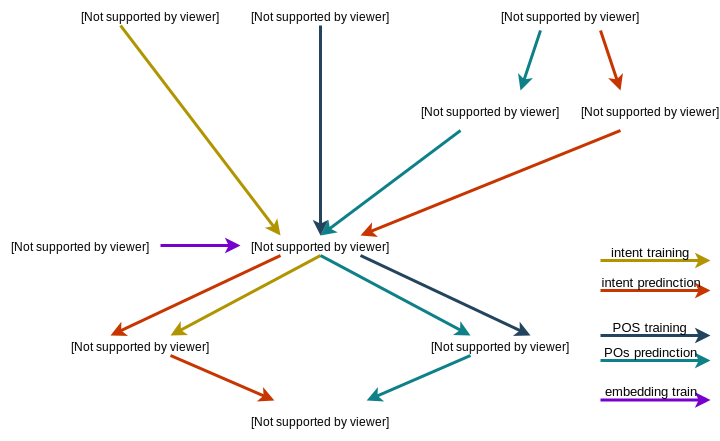
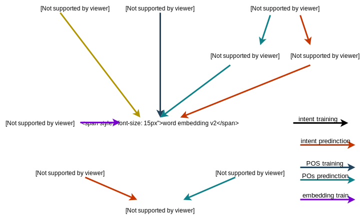
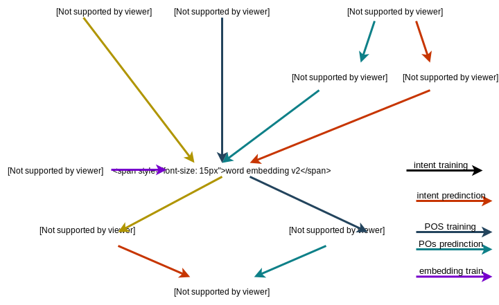

Versioning
==========

One of the key principles of Chariots is versioning. This means that Chariots will enforce what we consider to be good
versioning practices during the deployment, retraining and updating phases over the lifetime of your your `Chariots`
app.

Why Version Machine Learning Pipelines?
---------------------------------------

You might ask yourself why we would need to version the different models in our ML pipelines. For Kaggle competition I
just train my models in order predict on the test set and submit right? Although this workflow works to a certain extent
on small production project it can soon become quite a mess.

For instance if you try to build an NLP micro-service in your architecture, you will probably have a unique well
performing word embedding model and several other smaller models (intent classifier, POS, ...) that you retrain more
often. In this setup you have two choices when it comes to training:

- you can retrain every model in the right order every time you redeploy your micro-service. This is the extension of
  the Kaggle approach but means you will end up loosing some time retraining unnecessary models (which will slow down
  your deployment process and cost you in machine time)
- you can trust yourself to know what models need to be retrained and to do it right each time. If you choose to do this
  you will eventually end up in a mess where you forgot to retrain a classifiers after retraining your embedding model
  (and your classifier outputting nonsense ...)

Chariots provides you with a third option by enforcing the versioning logic in your pipelines framework. This means that
when you try to load (at start up or after a manual retrain) a pipeline, `Chariots` will check that every model
has a valid link (has been trained with) to the version of the preceding model and will not load if said valid link is
not found

Semantic Versioning in Chariots
-------------------------------

Chariots tries to stick to the `Semantic Versioning <https://semver.org>`_ guidelines. This means that all the versions
in `Chariots` are comprised of three subversions (Major, Minor, Patch). This also means that the checks chariots makes
on versions (described above) will only apply to the major versions (although we plan to make this user customizable in
the future).

One major difference between Chariots and traditional Semantic versioning is the use of incremental number. For
practical reasons, chariots uses three hashes instead of thee numbers and the ordering of those versions comes from the
time stamp of the version.

Version and Pipeline Interactions
---------------------------------

In this section we will try to explain in more details how `chariots` creates and updates links between different
versions of your models.

`Chariots` treats each pipeline as a DAG using part of some shared nodes. if we take back our NLP example:

here a link between to nodes of a pipeline represents a valid version meaning that that here all the nodes accept their
parent node in the pipeline. However if we retrain our embeddings, our DAGs will look like this:

here there is no valid link between the embedding and the other models (POS and Intent). We than need to retrain and
recreate those links:

Once this is done a new version of our POS and intent models have been created and a valid link has been submitted by the
training pipelines. when trying to reload the prediction pipelines, those will see this new link and accept the new
versions of their nodes.
